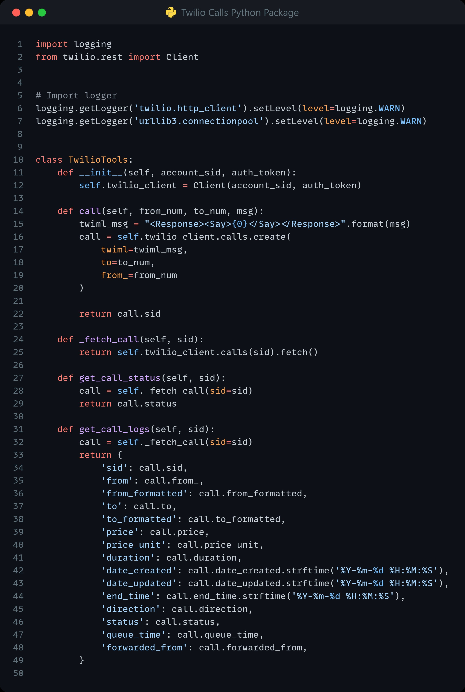

<!-- PROJECT SHIELDS -->
<!--
*** I'm using markdown "reference style" links for readability.
*** Reference links are enclosed in brackets [ ] instead of parentheses ( ).
*** See the bottom of this document for the declaration of the reference variables
*** for contributors-url, forks-url, etc. This is an optional, concise syntax you may use.
*** https://www.markdownguide.org/basic-syntax/#reference-style-links
-->

<a name="readme-top"></a>

[![LinkedIn][linkedin-shield]][linkedin-url]


<!-- PROJECT LOGO -->
<br />
<div align="center">
    

  <h3 align="center">Twilio Calls Python Package</h3>

</div>


<!-- TABLE OF CONTENTS -->
<details>
  <summary>Table of Contents</summary>
  <ol>
    <li>
      <a href="#about-the-project">About The Project</a>
      <ul>
        <li><a href="#built-with">Built With</a></li>
      </ul>
    </li>
    <li>
      <a href="#getting-started">Getting Started</a>
      <ul>
        <li><a href="#libraries">Libraries</a></li>
        <li><a href="#packages">Packages</a></li>
        <li><a href="#service-accounts">Service Accounts</a></li>
        <li><a href="#known-exceptions">Known Exceptions</a></li>
      </ul>
    </li>
    <li><a href="#usage">Usage</a></li>
  </ol>
</details>


<!-- ABOUT THE PROJECT -->
## About The Project


* Project Name: Twilio Calls Python Package
* Version: v1.0.0
* Organization Department: Technology

### Description

A Python package that integrates with Twilio to make automated 
calls and retrieve call logs. It can be used to automate 
phone-based communications workflows. With this package, 
You can easily initiate phone calls, monitor the status of 
those calls, and retrieve detailed logs that include information 
such as call duration, cost, and more.

<p align="right">(<a href="#readme-top">back to top</a>)</p>


### Built With

This project was developed using the following tech stacks:

* Python

<p align="right">(<a href="#readme-top">back to top</a>)</p>


<!-- GETTING STARTED -->
## Getting Started

In this section, I will give you instructions on setting up this project locally.
To get a local copy up and running follow these simple steps.

### Libraries

* pip
  ```sh
  pip install twilio==7.16.3
  ```

### Packages
* twiliotools
* Logger
* datetimetools
* file

### Service Accounts
* None

### Known Exceptions
* None

<p align="right">(<a href="#readme-top">back to top</a>)</p>


<!-- USAGE EXAMPLES -->
## Usage

### Screenshots

#### TwilioTools Package:


#### Using TwilioTools Package:


<p align="right">(<a href="#readme-top">back to top</a>)</p>


<!-- MARKDOWN LINKS & IMAGES -->
<!-- https://www.markdownguide.org/basic-syntax/#reference-style-links -->
[linkedin-shield]: https://img.shields.io/badge/-LinkedIn-black.svg?style=for-the-badge&logo=linkedin&colorB=555
[linkedin-url]: https://www.linkedin.com/in/m-abdelgawad/
